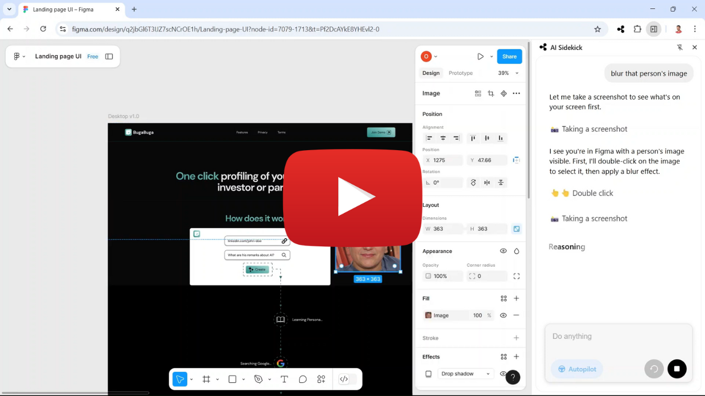

# Adam & Eve – Your OpenSidekicks 🧑‍💻👩‍💻

> ### 📅 Last Updated: **May 2, 2025**

## OpenSidekick 🤖

A browser-based AI sidekick that helps automate repetitive tasks, guide users through complex software, and streamline workflows — all powered by open agents.

## ⭐ Stay Tuned

If you're excited about the idea of AI sidekicks for your browser and beyond...

👉 **Star this repo** ⭐ to get notified about upcoming updates, full code release, and documentation.

## 📅 Progress Tracker: May 2, 2025

Stay in the loop as we build the foundations of OpenSidekick.  
Each key milestone gets updated daily with a visual indicator of progress:

| Task                             | Status          |
| -------------------------------- | --------------- |
| 🧩 Local API Keys Refactoring    | ██████░░░░░ 60% |
| 🔐 Lower Browser Permissions     | ░░░░░░░░░░░ 0%  |
| ⚡ Reduce Latency                | ░░░░░░░░░░░ 0%  |
| 🎯 Improve Quality & Evaluations | ░░░░░░░░░░░ 0%  |
| 🪄 Responsive Sidekick Banner    | ░░░░░░░░░░░ 0%  |
| 🚀 **Launch!**                   |                 |

> A task will be marked with a ✅ once complete.

## 🧪 Watch the Figma Demo

## 📢 Coming Soon

-   💻 Full open-source codebase
-   🧱 Modular architecture and setup guide

## 👥 Contributors

Made by [@OmerHefets](https://github.com/OmerHefets) and future contributors.  
Pull requests, feedback, and ideas are welcome!
