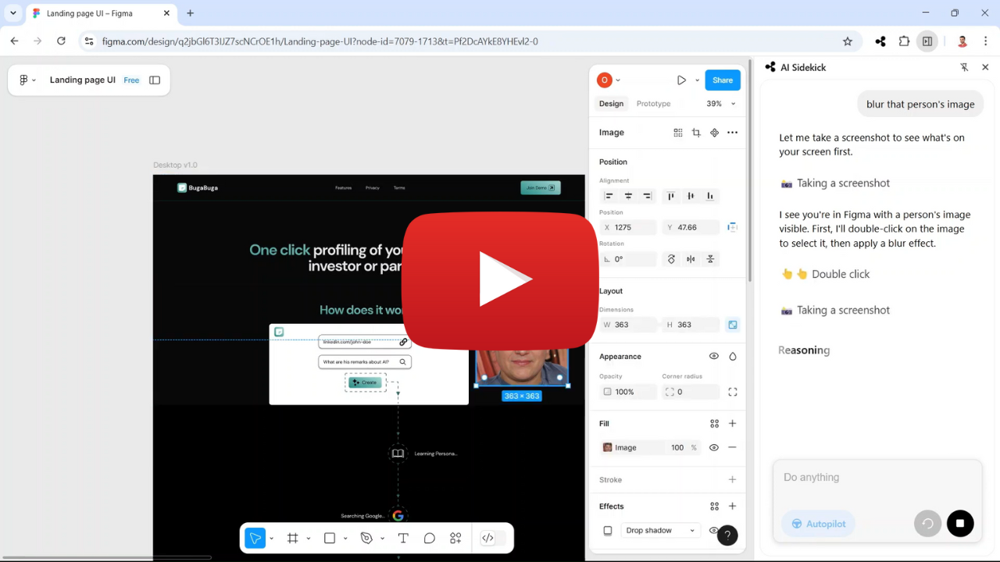

# Adam & Eve – Your OpenSidekicks 🧑‍💻👩‍💻

## OpenSidekick 🤖

**A browser-based AI sidekick** that helps guide you through complex software and streamline workflows — powered by open agents.

Tired of spending hours searching for helper articles? Watching long tutorials to figure out basic features? Endless conversations with your favorite AI models?

**OpenSidekick has your back.** 🎯

Get real-time, on-screen help with:

-   🧑‍🏫 **Copilot Mode** – learn by doing, with friendly guidance
-   ⚡ **Autopilot Mode** – let the agent take over and boost your productivity

## ⚠️🚨 Caution: Pre-Alpha Release 🚨⚠️

🚨 **This is an extremely early and buggy build. Use with caution.**  
💡 We're prioritizing stability and quality — rapid improvements ahead.

> 🧪 _“If you're not embarrassed by your MVP, you’ve launched too late.”_

### 🚧 Known Issues

❌ Requires frequent resets between runs  
🔥 Fixes are actively in progress!

## ⭐ Stay Tuned

If you're excited about AI sidekicks for your browser and beyond...

👉 **Star this repo** ⭐ to follow progress and get notified of big drops!

## 📹 Watch the Demo

  
  
<em>A sneak peek at OpenSidekick guiding actions in real time — right in your browser.</em>

## 🧪 Full Figma Demo

## 🧩 Install the Chrome Extension

## 📢 Coming Soon

-   💻 Full open-source codebase
-   🧱 Modular architecture and setup guide
-   🧠 More intelligent agent coordination

## 👥 Contributors

Made by [@OmerHefets](https://github.com/OmerHefets) and future contributors.  
Pull requests, feedback, and ideas are very welcome!
